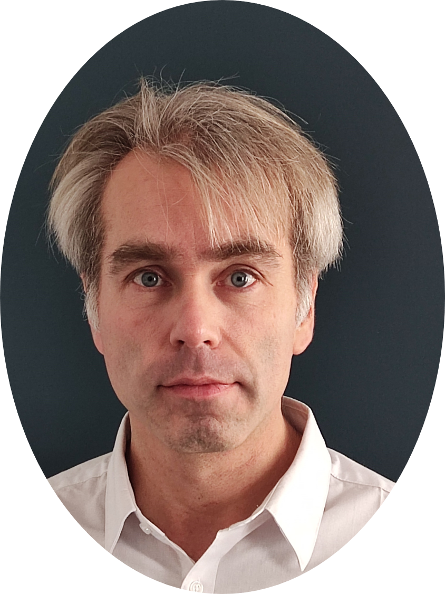

{:style="max-width: 200px; border-radius: 50%;" }

# 👋 Welcome

I’m a computational biologist with over 15 years of experience at the interface of life sciences, data analysis, and high-performance computing. I specialize in:

- Metagenomics & pathogen detection
- HPC and cloud-based workflows (SLURM, Google Cloud)
- Data analysis in R, Python, and Shell
- AI & bioinformatics integration

I’m passionate about applying reproducible, scalable tools to real-world problems in public health and environmental genomics.

## 🔬 Current Focus

I specialize in computational biology and bioinformatics with a focus on leveraging high-throughput sequencing, single-cell technologies, and reproducible pipelines for health and environmental research. My core interests include:

### 🧬 Single-Cell Analysis in Immuno-Oncology
I am deeply engaged in the analysis of **single-cell RNA-seq** and **multi-omics** datasets to dissect immune cell heterogeneity, tumor-immune interactions, and therapeutic responses in cancer. I work on:
- **Cell type annotation** and **trajectory inference** to uncover functional states of immune populations.
- **Tumor microenvironment (TME)** characterization in the context of checkpoint blockade and adoptive cell therapy.
- Integrating **spatial transcriptomics** and **scRNA-seq** to gain tissue-resolved insights into immunotherapy responses.

### 🧫 WGBS & Epigenetic Profiling
I develop workflows for **Whole Genome Bisulfite Sequencing (WGBS)** to study DNA methylation changes in immune cells and tumor contexts. My focus includes:
- Identifying **epigenetic biomarkers** predictive of treatment resistance or response.
- Correlating **methylation landscapes** with gene expression and chromatin accessibility.

### 🌍 Metagenomic Surveillance & Pathogen Detection
I contribute to microbial risk assessment using **shotgun metagenomics** and **16S rRNA profiling** in hospital and environmental settings. Current work includes:
- Automating taxonomic and functional profiling pipelines with tools like **Kraken2**, **MetaPhlAn**, and **HUMAnN**.
- Supporting antimicrobial resistance monitoring and source tracking.

### ⚙️ HPC & Cloud-Scale Bioinformatics
With experience on **SLURM**, **SGE**, and **Google Cloud**, I build scalable workflows using:
- **Snakemake** and **Nextflow** for reproducible research.
- **Docker**, **Singularity**, and **Conda** for software packaging and portability.

### 🧠 Machine Learning in Genomics
As a growing interest, I explore ML/AI applications in:
- Immune repertoire analysis.
- Metagenomic pattern recognition.
- Embedding techniques for DNA/RNA sequences using transformers and contrastive learning.
- AI in microbial genomics
- Nextflow / Snakemake workflows
- Continuous upskilling in modern tools (e.g., transformer models, spatial omics)

---

### ⚡ Tools & Languages
**R**, **Python**, **Bash**, **HPC**, **GCP**, **Seurat**, **Scanpy**, **bsseq**, **Bioconductor**, **scvi-tools**, **QDNAseq**, **GATK**, **Bismark**, **minfi**, **Nextflow**, **Snakemake**, **MultiQC**

# Additional Information

[📄 my CV on GitHub](./cv.md)  
[📄 Download my CV](./MathiasVandenbogaert_CV_2025.pdf)  
[🔗 My GitHub](https://github.com/mvdenbog)  
[📧 Contact Me](mailto:mathias.vandenbogaert@gmail.com)  
📇 [ORCID: 0000-0002-3073-9688](https://orcid.org/0000-0002-3073-9688)  

📇 [My ORCID profile](https://orcid.org/0000-0002-3073-9688) includes all my publications.

[📄 my publications on GitHub](./publications.md)
